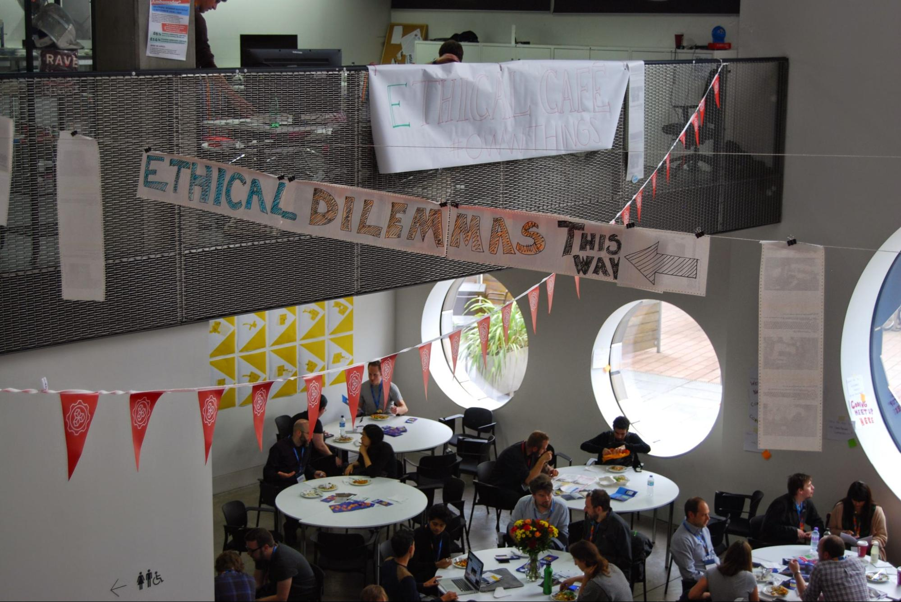
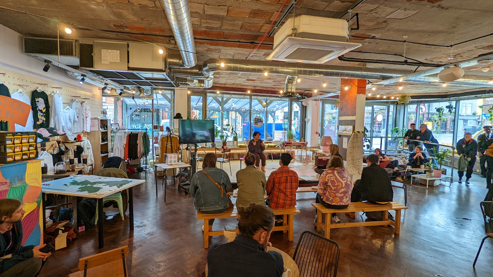
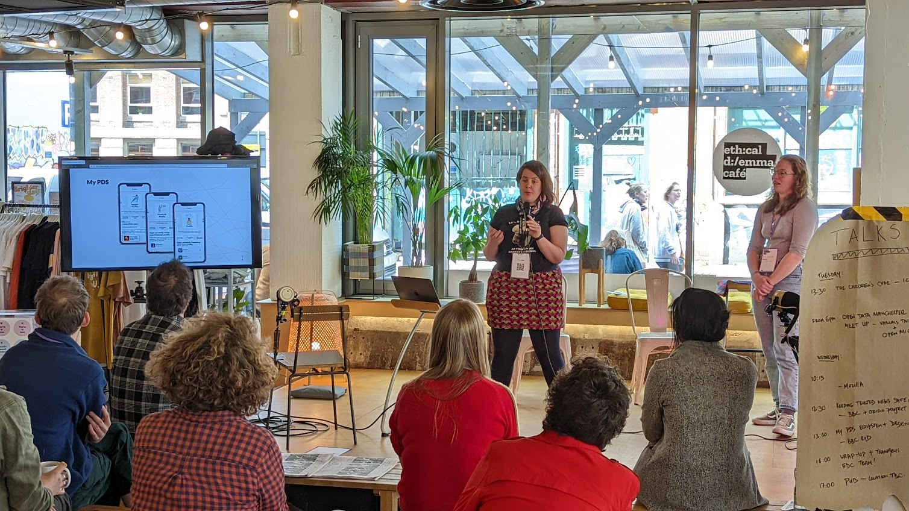
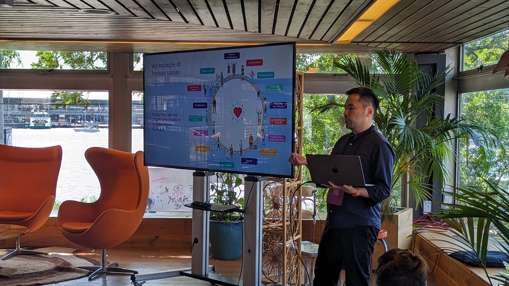
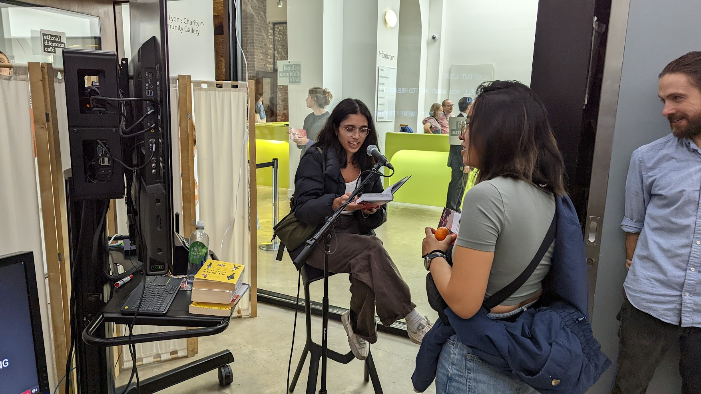
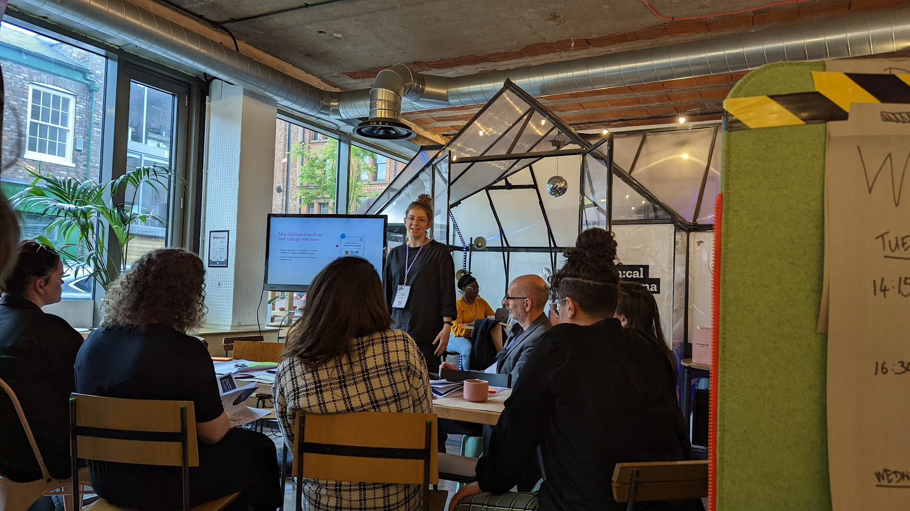

# What is the Ethical Dilemma Café?

The Ethical Dilemma Café is a public space where  individuals are invited to take part in  installations, participate in discussions, and attend workshops that explore the pressing ethical issues surrounding the use of personal data today.

At the Café, your personal data is your currency. Each Café revolves around a ‘Dilemma’ - a common online problem we encounter everyday. Attendees are presented with scenarios where they must decide their own ethical boundaries. How much would you reveal about yourself for a free coffee? What about the latest smartphone? Or for a once-in-a-lifetime travel experience? Each scenario prompts you to evaluate the real cost of your privacy, consider how much you’re willing to compromise your identity and where you draw the line.

Each dilemma challenges how much personal data you’re willing to expose and the extent of responsibility you're prepared to accept as your data shapes your identity and your community, potentially forever.

The Café is designed to be an open, inclusive, and safe environment, encouraging discussions on the ethical implications of data collection and usage. Serving as a platform for addressing broader data-related issues, we aim to explore how we can reclaim our agency in the face of these dilemmas and work towards a healthier digital future.

## What do we mean by ‘dilemma’? 

Data is at the heart of the Ethical Dilemma Café.

Today, our experiences, both online and offline, are defined by data. Tech platforms, their algorithms, advertisers, and others entities, collect and commodify every click, swipe, and voice command we make. In this system, individuals have little control. We’re all opted in, and often, without significant insight into how our data is being used. 
The Ethical Dilemma Café serves as both a metaphor and provocation, bringing to life the often invisible and invasive  aspects of our data driven world. Want a coffee? That’ll cost you personal information. Want to spend time in the Café? You’re opting into cameras and microphones recording you all day. 
The Café is full of metaphors, artwork, and experiences that further illustrate these points. For instance, visitors can have a free hot drink or snack— but only if they answer questions like, “When did you last sing to yourself?” In the Café, your data is the currency, fueling an economy where you can see the visible consequences of your decisions. Your data– like your future– is no longer solely your own.

## History of the Ethical Dilemma Café

The Ethical Dilemma Café made its debut at [Mozilla Festival in 2014](https://book.mozillafestival.org/10-years-of-activism-community-and-collaboration/ethical-dilemma-cafe), at a time when the public was just starting to voice their growing concerns about hidden microphones, cameras and other covert surveillance technology. Our response was to call for more transparent ways for people to be able to disconnect, clearer privacy policies, and reclaim control over our data. 

Since 2014, we’ve seen shifts in our societal understanding and interaction with technology, but some question still remains: has technology become more transparent and ethical, or have we just become more complacent about the control we yield over our personal information?

In 2022, the Ethical Dilemma Café showed people how their data reflects their identity in the digital world. It made the role of algorithms in determining our privileges and limitations transparent, compelling visitors to scrutinise the accuracy and impact of these technologies on their lives, both online and offline.

The Ethical Dilemma Café has always been a magnet for the public, as it creates an ideal environment for discussions and engagements about the relationship between technology and our daily lives. As we continue to navigate this evolving dynamic, we intend to further experiment with the structure that makes the Ethical Dilemma Café such a successful catalyst for critical thought.

## Ethical Dilemma Café Framework

Each Ethical Dilemma Café is typically composed of several key segments. While some elements like the dilemmas and art installations are essential, other components such as discussions and workshops are valuable optional additions that can enrich the experience.

* The Dilemma is essential. Each dilemma represents a common online problem we encounter, like exchanging personal information for discounts and access to other services that usually are not proportional to the value of the data shared.

* Art Installations & exhibitions are also essential. They should each demonstrate the value of data and ethical technology in a way that can be understood and interpreted by attendees.

* Discussions are optional. Talks are another great format of sharing enriching, appropriate content. They usually feature insights from relevant experts who can provide insight into the real-world value of data.

* Workshops are also optional. They enable participants to collectively engage with and explore the value and significance of their data together.

## Program Structure

To host a successful Ethical Dilemma Café, the programming of the event should be accessible, interesting to a wide general audience and involve audience participation. 

The Café must be easy to understand and offer value of exchange. The design of the space should facilitate self-navigation, offer a space for participants and attendees to meet and explore the content offered, and the space, at their own pace.

### Installations

Installations are an introduction to the story of your dilemma, inviting the audience to pause, learn and participate. Formats like games, literature, art and videos that are interactive are particularly effective in creating curiosity and inviting people to interact. All installations should have a low barrier to entry, allowing for self-navigation. This means the installations in the space must have  clear and accessible descriptions. 

### Discussions

Short talks of approximately 10-15 minutes provide attendees a digestible snapshot of a particular topic alongside the opportunity to deepen their understanding and participation.  A follow-up Q&A session is a great way to steer their attention towards potential workshops and installations – providing them with food-for-thought. Conversations in the Café should encourage participants to conceptualise the issues around unethical data usage and their agency in solving this problem.

### Workshops

Workshops are designed to be longer, interactive sessions sharing different ways attendees can reclaim control over their data. They provide practical tools and tips that people could use to work towards having a better, more sustainable and transparent relationship with technology. Workshops encourage participants to come together and collaborate through the use of tools like post-it notes to track ideas, and poster boards for mapping suggestions and possible next steps. 

The facilitation of these sessions is paramount – accessible formatting with a clear agenda of the desired outcomes of the workshop, space for everyone to contribute, and thorough documentation of ideas and suggestions and shared next steps are the benchmarks of a successful Café. 

To learn more about participatory design, visit the Creating Participatory Events section in the [How To MozFest Book](https://book.mozillafestival.org/creating-participatory-events).

## To Get Started

1. **Define your dilemma.** Be deliberate in how your Ethical Dilemma Café is responding to the needs of your local community. What are the issues they’re currently facing? Where are the opportunities to build and challenge? 
2. **Find your co-designers.** It’s important to identify collaborators who will help you co-design and co-deliver the event. The easiest way to do this is by thinking about the needs of the community you’re seeking to address and selecting partners who share a similar vision and commitment.
3. **Build partnerships.** The success of your Ethical Dilemma Café is dependent on how far you go to address the needs of your local community. Building partnerships with people and organisations can help you gain greater understanding of the current needs of the community and dynamics of it. This includes potentially reaching out to Universities and local businesses.
4. **Select a venue.** Choose a location that meets your participants where they are, rather than expecting them to come to you. The venue should be accessible and play a dual role as a space for your community to come together and meet new people alongside exploring the content you’re presenting related to your dilemma. Think a café, community hall or gallery.
5. **Design for all learning styles.** Provide installations that cater towards different modes of engagement and various levels of familiarity of your topic – from novice to expert– as a way to encourage people to learn and get involved in different ways.
6. **Embrace Imperfection.** Allow space for people to interact with your Café installations and dilemma, evolve with your event and learn from the space. The goal isn’t perfection, it’s adaptability and understanding.
7. **Say what you need.** We’ve found participants are often willing to help but to do so, they need to know what you need. Whether it’s bringing some supplies with them or more substantial tasks, clear communication helps everyone contribute effectively.
8. **Communicate and share**. Feel free to use blogs, emails, and documentation to reach as broad of an audience as possible. Remember to keep local people and communities in the loop too.
9. **Download the logo.** The Ethical Dilemma Café logo is available for use by anyone running an event under a CC-ND licence. For self-supported events, you are also free to use your own branding. For all supported events, the Ethical Dilemma Café logo must be used. There are more details about the tiers of support below.
10. **Need or interested in support?** Have a look at our levels of support for future Ethical Dilemma Café on the separate page.

More questions? It might be answered in the updated Frequently Answered Questions page.

