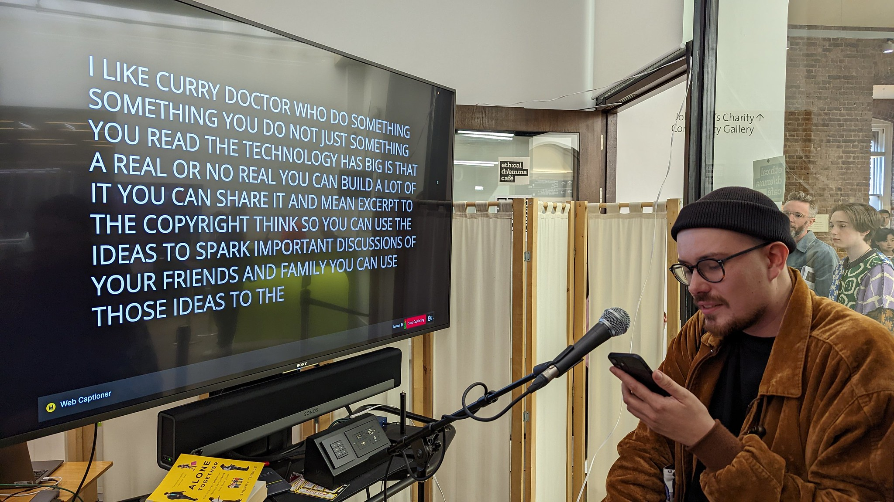

# Useful Resources

## Facilitation Support for Presenters, Speakers & Panellists
For more insight on how to host accessible, interactive and inclusive sessions, check out our [Facilitator guidelines for Mozilla Festival](https://www.mozillafestival.org/resources/facilitator-guide/).

### Press Coverage
* BBC | [Read more here](https://www.bbc.co.uk/rd/blog/2014-10-mozilla-festival-2014)
* BBC | [Read more here](https://www.bbc.co.uk/rd/blog/2015-03-walls-have-eyes-at-the-design-museum)
* About Manchester | [Read more here](https://aboutmanchester.co.uk/people-in-manchester-can-get-free-coffee-this-week-in-exchange-for-personal-info/)
* Imagination Lancaster | [Read more here](https://imagination.lancaster.ac.uk/update/taking-your-research-on-the-road/)
* Evening Standard | [Listen to the podcast here](https://play.acast.com/s/tech-science-daily/elon-musk-urged-to-clean-up-twitter)
* Open Data Manchester | [Read more here](https://www.opendatamanchester.org.uk/ethical-dilemma-cafe-2022/)
* Victoria & Albert (V&A) Museum | [Discover more here](https://www.vam.ac.uk/event/VgB76ELyK4/ethical-dilemma)

### Photos from Previous Events
* MozFest 2014 | [View Photos](https://www.flickr.com/photos/mozfest/albums/72177720316484245/)
* Manchester, Feel Good Cafe, Northern Quarter 2022 | [View Photos](https://www.flickr.com/photos/mozfest/albums/72177720316486527/)
* The Victoria & Albert (V&A) Museum 2022 | [View Photos](https://www.flickr.com/photos/mozfest/albums/72177720316491526/)
* MozFest House Amsterdam 2023 | [View Photos](https://www.flickr.com/photos/mozfest/albums/72177720316486662)
* You can also find a short video recap of Ethical Dilemma Café Manchester 2022 from the point of view of an attendee [here](https://www.youtube.com/watch?v=CQrgcL6jHw0).

### Blogs about the Café
* In the lead up to the Café | [Read here](https://foundation.mozilla.org/blog/ethical-dilemma-Café-in-manchester-2022/)
* Promotion for an upcoming Café | [Read here](https://foundation.mozilla.org/blog/the-ethical-dilemma-cafe-uses-coffee-to-scrutinize-data-privacy/)
* Installations taking place at the Café | [Read here](https://foundation.mozilla.org/blog/ethical-dilemma-Café-at-mozfest-house/)
* Key takeaways from the Café | [Read here](https://foundation.mozilla.org/blog/ethical-dilemmna-Café-2022/)
* A recap from an attendee | [Read here](https://foundation.mozilla.org/blog/ethical-dilemma-Café-kicks-off-community-ethics-in-tech-project/)
* A recap of the Café | [Read here](https://cubicgarden.com/2022/05/08/mozilla-bbc-ethical-dilemma-Café-manchester/)

