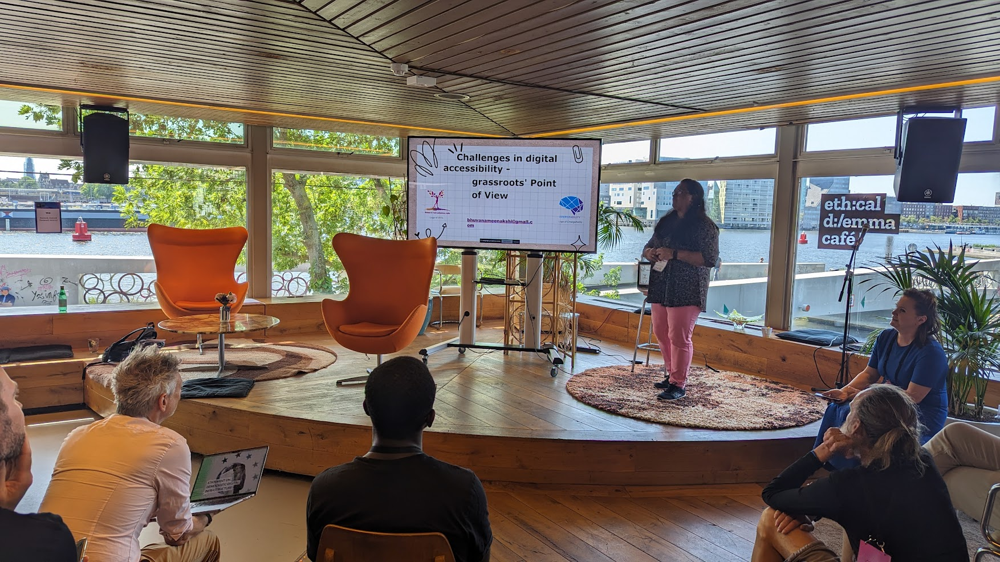

# Frequently Asked Questions (FAQ’s)

**1. How do I inquire about more personalised support?**

For more tailored support inquiries, please reach out to us

**2. How long should my Ethical Dilemma Café be?**

The duration of your café should allow for thorough exploration of the dilemmas without overwhelming the participants. Typically, a half-day to a full-day event is recommended.

**3. Can I run an Ethical Dilemma Café online?**

Yes, Ethical Dilemma Cafés can be hosted online. When doing so, it's important to include breakout groups and provide space for reflective thinking. Be mindful of different ways people can participate in your event.

**4. Are these language or localisation considerations for Ethical Dilemma Cafés in non-English speaking regions?**

Yes, it’s important to adapt your café to the local language and cultural nuances to ensure it's accessible and relevant to the audience.

**5. What if I encounter a challenge during the planning or execution of my Ethical Dilemma Café?**

If challenges arise, please reach out to us

**6. Is there a community or network of Ethical Dilemma Café organisers I can join to gain advice?**

Yes, we recommend joining the Mozilla Festival Discord. You’ll find a dedicated channel, #EDC, where you can connect with other organisers and share insights.

**7. Is there an ideal number of participants for an Ethical Dilemma Café?**

We recommend a practical ratio of two organisers for every twenty participants. There's no set limit or minimum, but try to curate the ambiance to ensure the best experience for your participants.

**8. Are there restrictions on the type of venue I can use for an Ethical Dilemma Café?**

The venue you chose should support the format of the Café and be accessible to all participants. There are no strict restrictions, but you should carefully consider the suitability of the venue based on needs of your specific event and audience.

**9. Is there funding available for hosting an Ethical Dilemma Café?**

Funding is not provided by the Mozilla Festival, Mozilla, or BBC Research and Development. However, we can offer guidance on fundraising and resource management.

**10. Can I host multiple Ethical Dilemma Café events or make it a recurring series?**

Yes, hosting multiple events or a recurring series is encouraged. It's important, however, to keep the dilemma your Café is centred around unique to maintain its impact.

**11. What kind of follow-up or share out should I do with you and participants after hosting an Ethical Dilemma Café?**

Ideally, if you’re hosting a Café, you should create a pull request on GitHub. This allows us to systematically integrate stories and experiences into our repository. Additionally, you can also reach out to us to share your experience. 

**12. Can I run an Ethical Dilemma Café during or as part of another event?**

Yes, you can run an EDC as part of another event. There is also the opportunity to partner with Mozilla Festival to co-create a Café with them.

