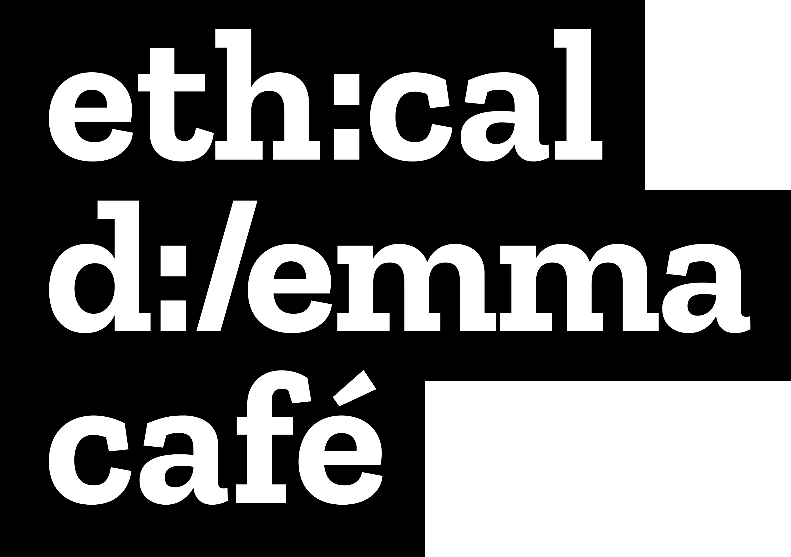
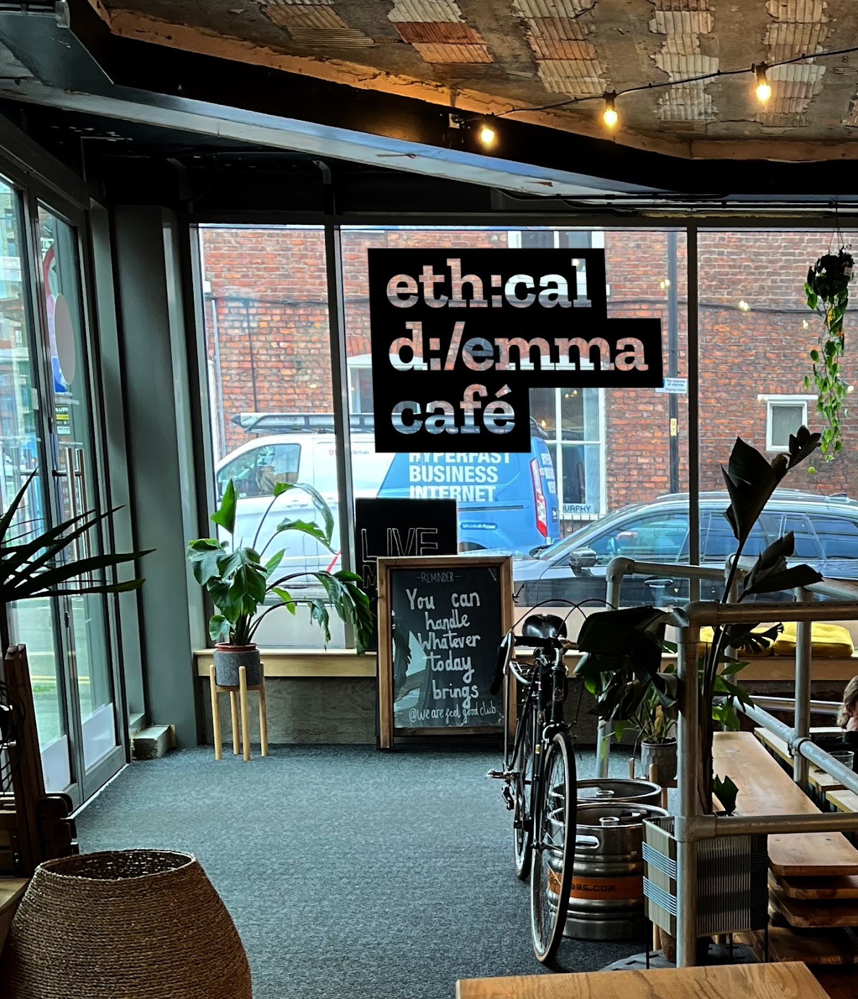

# Tiers of Support 

### Tier 1: Self-support
**Organise your own event independently using our detailed blueprint above without direct support from Mozilla and/or BBC Research & Development. The blueprint includes:**
* Guidance on core values and guidelines
* Participation guidelines
* Project schedule template
* List of supplies and considerations checklist

### Tier 2: Basic Support
**Receive up to three hours consultation from Mozilla and/or BBC R&D alongside general support during the design and pre-production process. In total this tier includes:**
* All materials provided in the self-support tier
* An initial 1-hour consultation with a representative from Mozilla & BBC R&D providing  contextual support, venue advice and fundraising guidance (Note: funding is not provided).
* A mid-way 1 hour review session to answer any questions you may have, provide guidance, and feedback.
* A pre-event 1-hour meeting for final checks and questions. 

**Additional Support Options**
Mozilla and the BBC can also provide additional assistance with the following*:
* Guest speakers
* Workshop content suggestions
* Advice on hosting workshops
* Installations ideas

### Tier 3: Full Support
**For events partnered with Mozilla Festival, Mozilla and BBC Research & Development, we will co-produce the Café, providing you with:**

* All materials provided in the basic support tier
* Regular check-ins and assistance with pre-event coordination
* Logistical assistance from the Mozilla event manager and team** who will manage the:
  * Venue
  * Catering
  * Tech support needs
  * Stakeholder meetings
  * Site visits (where relevant and appropriate)
  * Communication support as part of the wider Mozilla Festival event

*Additional support from Mozilla is only available on a paid, consultation basis.

**Details of partnership roles and responsibilities will be further outlined during negotiations.

